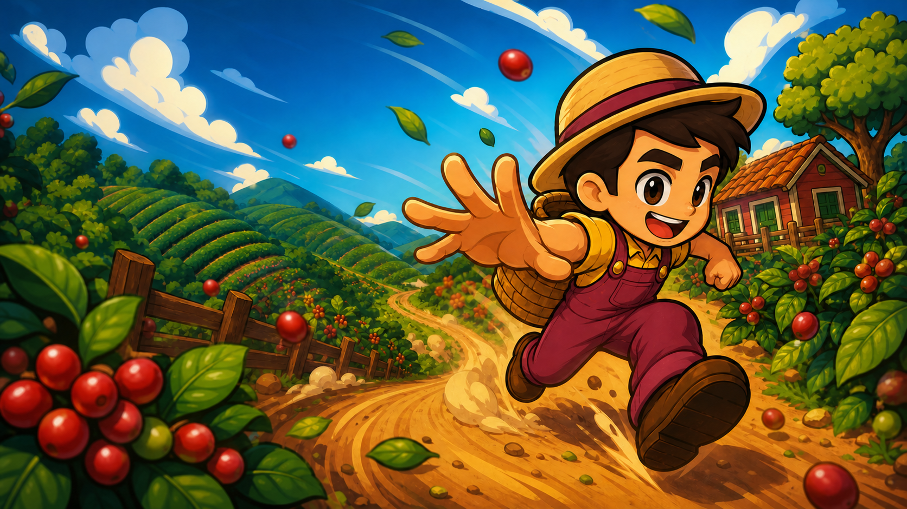

# Rota do Café



Runner 2D em estilo chibi, ambientado em uma fazenda de café.

Cada partida dura 45 segundos.

## Tecnologia

- JavaScript
- Vite
- HTML/CSS para interface e ranking local

## Como executar

No Windows, dê dois cliques em `INICIAR_JOGO.bat`. O servidor será iniciado e o navegador abrirá automaticamente.

Alternativamente, pelo terminal:

```powershell
npm install
npm run dev
```

## Controles

- Seta para cima, W ou espaço: pular
- Seta para baixo ou S: manter o personagem agachado
- Controle: A pula e B agacha
- Celular: deslizar ou usar os botões na tela

## Operação do evento

- O ranking fica salvo localmente no navegador.
- Nome e telefone são adicionados ao arquivo `participantes.txt`.
- O botão **Painel do evento** abre a área administrativa.
- Senha inicial do painel: `2468`.
- O painel permite exportar o ranking em CSV e zerar as pontuações.
- O arquivo `participantes.txt` não é apagado ao zerar o ranking.

## Instalação no Android

Após publicar o projeto em um endereço HTTPS, abra o link no Chrome e escolha **Instalar app** ou **Adicionar à tela inicial**. O jogo abre em tela cheia e mantém ranking e cadastros localmente quando estiver offline.
